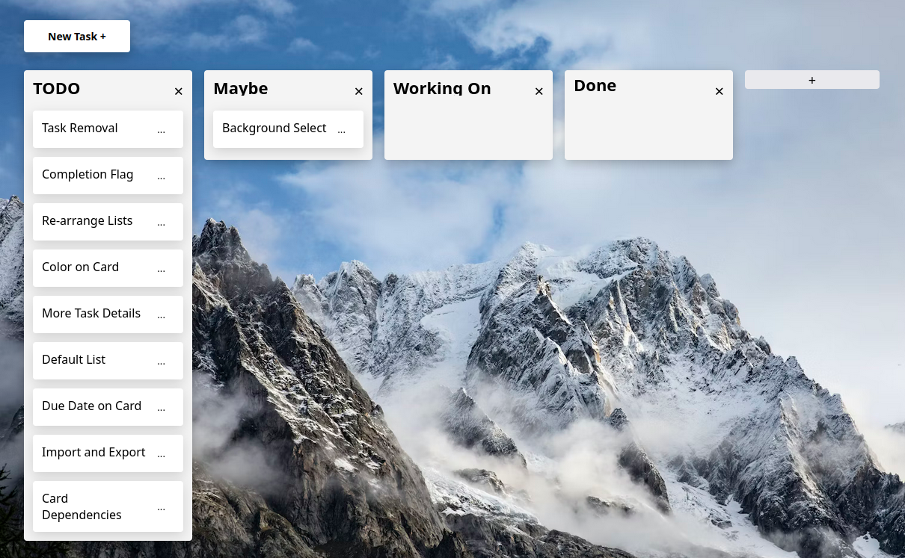

# Kanban Demo

Simple Kanban board to practice front-end development

## Features

-   List Creation / Removal
-   Tasks + Modal editor
-   Task drag n drop between lists
-   Simple error modal
-   Local storage
-   No frameworks, just JS and webpack :^)

## Dev dependencies

-   Webpack

## Currently Missing / Wanted

-   Completion flag
-   More task details and options
-   Color visible from card
-   Re-arrange lists
-   Background image select
-   import / export board
-   Draggable view horizontal, when many lists exist
-   Card dependencies. Allow cards to depend on others, so that completion cannot be marked unless depending cards are also marked as complete. (Depends on completion flag...)

## Sources Used

-   Background from Unsplash
-   https://www.youtube.com/watch?v=ecKw7FfikwI
-   https://www.w3schools.com/w3css/w3css_modal.asp
-   https://jasonwatmore.com/post/2023/01/04/vanilla-js-css-modal-popup-dialog-tutorial-with-example
